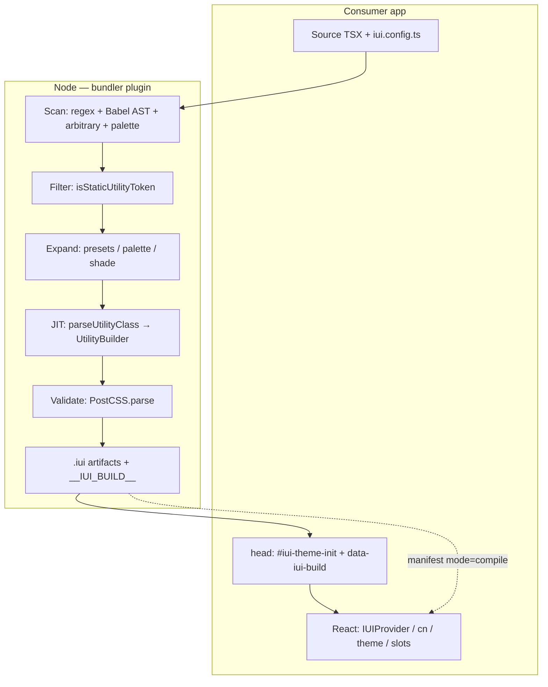

# 03 — Framework Architecture & Full Flow

**Package:** `@inventive-ui/framework`  
**Companion docs:** [01 — Compile-First Guide](./01-compile-first-guide.md) · [02 — Integration & Runtime](./02-integration-and-runtime.md)

This document explains **what the framework does end-to-end**: scan → parse → AST → JIT → validate → inject → browser apply, plus what **Babel**, **PostCSS**, **Node**, and the **browser** each own.

---

## 1. What this framework is

Inventive UI is a **utility-first CSS framework** (Tailwind-like classes + semantic tokens + theme).

| Layer | Owns |
|-------|------|
| **Compile pipeline (Node)** | Scan source → expand classes → JIT generate CSS → validate → write `.iui/` → inject into `<head>` |
| **Thin runtime (browser)** | `IUIProvider`, theme toggle / DOM sync, `useStates()`, slots, `cn` / `cva` (string merge only) |

**CSS is not generated in the browser anymore.** The bundler plugin is **mandatory**. Without it, utilities do not appear.

Confirm compile mode:

```js
globalThis.__IUI_BUILD__
// { mode: "compile", classCount, cssHash, … }
```

---

## 2. Big picture architecture

```
┌─────────────────────────────────────────────────────────────────────────┐
│                         CONSUMER APP                                     │
│  Source (TSX) + iui.config.ts                                            │
│         │                                                                │
│         ▼                                                                │
│  ┌───────────────────────────────────────────────────────────────────┐  │
│  │                    NODE (bundler plugin)                           │  │
│  │                                                                   │  │
│  │  1. SCAN      regex + Babel AST + arbitrary + palette patterns    │  │
│  │  2. FILTER    isStaticUtilityToken (reject prose / TS debris)     │  │
│  │  3. EXPAND    theme presets, palette maps, optional shade matrix  │  │
│  │  4. JIT       parseUtilityClass → UtilityBuilder → CSS strings    │  │
│  │  5. VALIDATE  PostCSS.parse + pollution checks                    │  │
│  │  6. WRITE     .iui/build-styles.*, manifest, cache                │  │
│  │  7. INJECT    <style|link data-iui-build> + #iui-theme-init       │  │
│  └───────────────────────────────────────────────────────────────────┘  │
│         │                                                                │
│         ▼                                                                │
│  ┌───────────────────────────────────────────────────────────────────┐  │
│  │                    BROWSER (thin runtime)                          │  │
│  │  HTML head already has theme script + stylesheet                   │  │
│  │  React: IUIProvider / className / cn / theme / slots               │  │
│  │  No parser, no builder, no MutationObserver CSS JIT                │  │
│  └───────────────────────────────────────────────────────────────────┘  │
└─────────────────────────────────────────────────────────────────────────┘
```

### Package entry points

| Import | Role | Where it runs |
|--------|------|----------------|
| `@inventive-ui/framework` | Provider, theme, `cn`, tokens, stubs | Browser |
| `@inventive-ui/framework/config` | Types / helpers for `iui.config.ts` | Config load (Node + types) |
| `@inventive-ui/framework/slots` | SlotRenderer, registerSlot | Browser |
| `@inventive-ui/framework/vite` | `inventiveUiVite()` | Node (Vite) |
| `@inventive-ui/framework/webpack` | `inventiveUiWebpack()` | Node (Webpack) |
| `@inventive-ui/framework/next` | `withIUI()` | Node (Next) |
| `@inventive-ui/framework/next/registry` | `IUIRegistry` SSR head inject | Server + client |
| `@inventive-ui/framework/server` | `generateBuildCSS`, SSR helpers | Node |
| `@inventive-ui/framework/node/build-css-api` | Slim Node API for plugins | Node |

---

## 3. Full pipeline (step by step)

Everything below runs in **Node** during `vite` / `webpack` / `next` **dev or build**, orchestrated by:

`integrations/shared/generate-build-css.mjs` → `generateBuildCSSForProject()`

### Step 1 — Scan

Discover every utility class string the app (and scanned packages) actually use.

| Scanner | File | What it finds |
|---------|------|----------------|
| Regex | `integrations/shared/scan-used-classes.mjs` | `className` / `class`, `cn` / `cva` / `cx` literals, static template segments |
| **Babel AST** | `integrations/shared/scan-used-classes-ast.mjs` | Same, but via parse + traverse (conditionals, arrays, object maps) |
| Arbitrary | `integrations/shared/scan-arbitrary-classes.mjs` | Tokens like `w-[120px]` |
| Palette patterns | `integrations/shared/scan-palette-patterns.mjs` | `` `bg-${palette}-500` `` + param defaults / TS unions / map keys |

File walk: `scan-source-utils.mjs` over `build.scanDirs` (default `["src", ".iui"]`) and `build.scanPackages` (default `@inventive-ui/components` dist).

Toggle AST with `build.useAst` (default `true`).

### Step 2 — Filter

`integrations/shared/utility-token-filter.mjs` → `isStaticUtilityToken()`

Rejects tokens that would poison the stylesheet:

- Prose / English words mistaken for classes
- TypeScript debris (`border-transparent";`, `TextProps["size"]`)
- Incomplete / dynamic fragments (`w-[" + x + "px]`)

One bad token must never break the whole CSS file.

### Step 3 — Expand

`src/server/expand-build-classes.ts` → `expandBuildClasses()`

Turns the scanned set into the full set that should emit CSS:

| Expansion | Purpose |
|-----------|---------|
| Theme presets | Spacing / radius / font presets from config |
| Palette patterns | Resolve `` `bg-${palette}-500` `` against known palettes → concrete `bg-brand-500`, … |
| Arbitrary set | Merge arbitrary scan results |
| Shade matrix | Full semantic shade/compose matrix — **opt-in** (`includeShadeMatrix: false` by default) |

### Step 4 — JIT generate (parse → build → CSS)

“JIT” here means: **only generate CSS for classes that were discovered** (plus expansions), at build/dev time in Node — **not** browser on-demand JIT.

```
classNames[]
  → generateBuildCSS(classNames, config)          // src/server/ssr-extraction.ts
      → initConfig + initializeGradients
      → merge gradient + state utility class names
      → generateFullThemeCSS(config)              // CSS variables, neutrals, …
      → utilityBuilder.buildUtilities(unique)
            → parseUtilityClass(class)            // src/engine/core/parser.ts
            → specialized builders (ring, gradient, …)
      → utilityBuilder.generateCSS(utilities)     // src/engine/core/builder.ts
      → leftovers → generateArbitraryCSSValue()   // src/server/generate-arbitrary-css.ts
  → return { themeCSS, utilitiesCSS, combinedCSS, builtClasses, uncoveredClasses, stats }
```

**Parser** (`parseUtilityClass`): splits a class into variants + category + value  
Example: `dark:hover:bg-brand-500` → variants `[dark, hover]` + utility `bg-brand-500`.

**Builder** (`UtilityBuilder`): turns parse results into CSS rule strings.

Uncovered classes log:

```
[IUI Dev] Class "…" was scanned but produced no CSS.
```

### Step 5 — Validate (PostCSS)

`integrations/shared/validate-build-css.mjs` → `assertValidGeneratedCss()`

- Custom pollution checks (broken `var(--…)`, quote-glued selectors, etc.)
- Then **`postcss.parse(css)`** as a syntax gate

PostCSS does **not** generate or transform utilities. It only **validates** that the engine output is real CSS.

### Step 6 — Write artifacts

`integrations/shared/write-build-css.mjs` + cache/manifest helpers:

```
.iui/
  classes.cache.json9              # per-file class map (HMR incremental)
  build-manifest.generated.js     # sets globalThis.__IUI_BUILD__
  build-styles.generated.css      # the stylesheet
  build-styles.generated.js       # optional JS injector (fallback only)
  build-css-inline.js             # inline helpers where needed
```

Safe to delete `.iui/` — regenerates on next dev/build. After a wipe mid-session, **restart the dev server**.

### Step 7 — Inject into `<head>`

Shared **head contract** (all bundlers):

1. Blocking `#iui-theme-init` script (dark/light **before paint**)
2. Styles via `<style data-iui-build>` **or** `<link data-iui-build>` **before** app JS
3. Entry imports build manifest → `__IUI_BUILD__.mode = "compile"`
4. JS injector is **fallback only** — not the primary path

Helpers: `integrations/shared/inject-build-styles-into-html.mjs`

| Bundler | How CSS reaches the DOM |
|---------|-------------------------|
| **Vite (dev)** | `transformIndexHtml` inlines `<style data-iui-build>…</style>` |
| **Vite (prod)** | Entry import of `iui-build-styles.css` → linked stylesheet |
| **Webpack** | HtmlWebpackPlugin HTML inject of `<style data-iui-build>` |
| **Next.js** | `IUIRegistry` inserts `<link data-iui-build href="/iui/{hash}.css">` (file under `public/iui/`) |

Example head result (conceptual):

```html
<head>
  <script id="iui-theme-init">/* set .dark / color-scheme early */</script>
  <style data-iui-build>
    :root { --iui-color-brand-500: … }
    .px-4 { padding-inline: … }
    .dark\:bg-brand-500:is(.dark *) { … }
  </style>
  <!-- or: <link rel="stylesheet" data-iui-build href="/iui/abc123.css"> -->
</head>
```

### Step 8 — Browser applies classes

React renders `className="px-4 bg-brand-500"`. The browser matches those selectors against the **already-present** stylesheet. No CSS engine boot when compile is active (`isCompilePipelineActive()` in `src/core/build-mode.ts`).

---

## 4. Babel — what it does (and does not)

**Babel is not a transform pipeline for your app code.**

Inventive UI uses Babel **only as a parser / AST walker at build time** so the scanner can see classes that regex might miss.

| Location | APIs | Purpose |
|----------|------|---------|
| `scan-used-classes-ast.mjs` | `@babel/parser` + `@babel/traverse` | Extract static class strings from JSX / `cn` / conditionals / maps |
| `scan-palette-patterns.mjs` | same | Detect palette template patterns + type/default signals |

Parser plugins used: `jsx`, `typescript`, `decorators-legacy` (+ `errorRecovery: true`).

**Babel does NOT:**

- Transform JSX for React (Vite/Next/SWC do that)
- Emit CSS
- Rewrite your source files
- Run in the browser as part of IUI

```
Source file
  → Babel parse → AST (Abstract Syntax Tree)
  → traverse nodes (JSXAttribute, CallExpression, TemplateLiteral, …)
  → collect string literals that look like utilities
  → hand class list to filter → expand → JIT
```

---

## 5. PostCSS — what it does (and does not)

**PostCSS is not the utility engine.**

| What PostCSS does here | What it does **not** do |
|------------------------|-------------------------|
| `postcss.parse(css)` after generation | Generate `px-4` / `bg-*` rules |
| Fail loud on invalid / polluted CSS | Autoprefixer / nesting / Tailwind-style plugin transforms |

File: `integrations/shared/validate-build-css.mjs`  
Dependency: `postcss` in `package.json`.

If PostCSS cannot be loaded, heuristic pollution checks still run; parse is skipped.

**Mental model:**

```
Engine (custom parser + builder)  →  CSS string
PostCSS                           →  “Is this valid CSS?” (gate)
Bundler                           →  put CSS in <head>
```

---

## 6. Node vs browser — who does what

### Node (build-time / SSR)

| Responsibility | Where |
|----------------|--------|
| Walk files + scan classes | `integrations/shared/scan-*.mjs` |
| Load `iui.config.ts` (`jiti`) | `generate-build-css.mjs` |
| Expand + JIT CSS | `src/server/*`, `src/engine/*` via `dist/node/build-css-api` |
| Validate / write `.iui/` | `validate-build-css.mjs`, `write-build-css.mjs` |
| Bundler plugins + HTML inject | `integrations/vite|webpack|next` |
| HMR regenerate on file change | Vite/Webpack watch hooks |
| Next SSR head (`IUIRegistry`) | `integrations/next/iui-registry.tsx` |

### Browser (runtime — thin)

| Keep | Skip when compile active |
|------|---------------------------|
| `IUIProvider` / `initFramework` | Browser CSS engine / `initializeRuntimeCSS` |
| `useThemeMode` / `useThemeLayout` / `applyMode` | Runtime palette CSS generation |
| `useStates()` → class strings + ARIA | Emitting focus/disabled/loading **CSS** (already in build sheet) |
| Slots | — |
| `cn` / `cva` string merge | `cn` → `generateCSS` |
| Stubs: `useColorPalette`, `useArbitraryValues`, `processClasses` | Real generation |

**Without the plugin:** no `__IUI_BUILD__.mode === "compile"` → utilities missing; framework warns.

---

## 7. How CSS gets into the DOM / `<head>`

Three delivery modes, same contract (`data-iui-build`):

### A) Inline `<style>` (Vite dev, Webpack HTML)

```
Plugin generates CSS
  → injectBuildStylesIntoHtml(html, css)
  → <style data-iui-build>…</style> before </head>
  → Browser parses stylesheet immediately (blocking for that document)
```

### B) Linked `<link>` (Next SSR, optional static)

```
Plugin writes public/iui/{hash}.css
  → IUIRegistry / HTML inject
  → <link rel="stylesheet" data-iui-build href="/iui/{hash}.css">
  → Browser fetches + applies before paint (when correctly ordered in head)
```

### C) JS injector fallback (rare)

`build-styles.generated.js` creates/updates `style[data-iui-build]` if the HTML path was unavailable. **Not** the preferred path.

### Theme before paint

`#iui-theme-init` runs early so `html.dark` / `color-scheme` exist before React hydrates — avoids light flash on dark preference.

### Legacy path (superseded)

Older runtime used `#iui-css-root` / `cssRootManager` / `injectGlobalStyles` in the browser. When compile is active, that path is skipped.

---

## 8. HMR (Hot Module Replacement) flow

### Vite (`integrations/vite/iui-css.mjs`)

```
File save (.tsx / config)
  → debounce (~200ms)
  → regenerate CSS (incremental if cache complete: true, else full scan)
  → if cssHash / themeInit changed → full-reload
  → else normal Vite module HMR
```

Important details:

- Writes under `.iui/` are **ignored** by the watcher (prevents write → rebuild loops)
- `iui.config.*` change → full regenerate; often full-reload
- Cache marked `complete: true` **only after a full `scanDirs` scan**
- Incremental HMR **never** promotes an incomplete cache to complete
- Prefer **full page reload** when CSS hash changes (stable head stylesheet) over fragile CSS-module HMR

### Webpack / Next

Watch regenerates on source / config change; ignores `.iui/`. Concurrent regenerates are deduped where needed (Next dual compilers).

---

## 9. Before vs after (architecture shift)

### Old — runtime Framework (browser JIT)

```
Import framework
  → ship parser + builder in client JS
  → when class appears / cn() runs → invent CSS in browser
  → inject into #iui-css-root in document.head
```

Problems: larger JS, FOUC risk, dual source of truth, dynamic `` `bg-${x}` `` “worked” only because the browser could invent rules.

### Current — compile-first (Node JIT)

```
Source + config
  → Node scan / expand / generate / validate
  → inject data-iui-build into head
  → browser only applies className
```

Dynamic `` `p-${n}` `` is **unsupported** unless safelist / static maps / palette pattern expansion covers it. ESLint rule `customPlugin/no-dynamic-utility-class` warns on those templates.

---

## 10. End-to-end sequence (one request / one save)

### First `vite` / `webpack` / `next` start

```
1. Plugin loads iui.config.ts (jiti)
2. Full scan of scanDirs + scanPackages
3. Filter → Expand → generateBuildCSS (JIT)
4. Validate with PostCSS
5. Write .iui artifacts + manifest (mode: "compile")
6. Inject theme-init + stylesheet into HTML / SSR head
7. Browser loads page → CSS already present → React mounts → classes match
```

### On file save (dev)

```
1. Watcher sees change
2. Incremental or full rescan
3. Rebuild CSS if class set / theme changed
4. Hash changed? → full reload (new head CSS)
5. Hash same? → normal HMR for that module only
```

### Production build

```
1. Same pipeline once (often minified)
2. Emit CSS asset or inline per bundler
3. Ship HTML with head contract
4. Client never runs the CSS engine
```

---

## 11. Key modules map

### Compile orchestration

| File | Role |
|------|------|
| `integrations/shared/generate-build-css.mjs` | Main orchestrator |
| `integrations/shared/scan-used-classes.mjs` | Regex scan |
| `integrations/shared/scan-used-classes-ast.mjs` | Babel AST scan |
| `integrations/shared/scan-palette-patterns.mjs` | Palette template signals |
| `integrations/shared/scan-arbitrary-classes.mjs` | Arbitrary utilities |
| `integrations/shared/utility-token-filter.mjs` | Token hygiene |
| `integrations/shared/validate-build-css.mjs` | PostCSS validation gate |
| `integrations/shared/write-build-css.mjs` | Disk artifacts + injector source |
| `integrations/shared/inject-build-styles-into-html.mjs` | Head style/link inject |
| `integrations/shared/build-cache.mjs` | Incremental HMR cache |
| `integrations/shared/build-manifest.mjs` | `__IUI_BUILD__` module |

### Engine (Node)

| File | Role |
|------|------|
| `src/server/ssr-extraction.ts` | `generateBuildCSS` |
| `src/server/expand-build-classes.ts` | Expand scanned set |
| `src/server/generate-theme-css.ts` | Theme CSS vars |
| `src/server/generate-arbitrary-css.ts` | Arbitrary leftovers |
| `src/engine/core/parser.ts` | Class → parse result |
| `src/engine/core/builder.ts` | Parse result → CSS |
| `src/server/build-css-api.ts` | Published Node re-exports |

### Browser

| File | Role |
|------|------|
| `src/index.ts` | Main browser entry |
| `src/core/build-mode.ts` | Detect compile pipeline |
| `src/core/context/iui-provider.tsx` | Provider |
| `src/hooks/compile-first-runtime-stubs.ts` | No-op generation hooks |
| `src/configuration/theme-options.ts` | Theme manager / DOM sync |

### Bundler plugins

| File | Role |
|------|------|
| `integrations/vite/iui-css.mjs` | Vite CSS + HMR + HTML inject |
| `integrations/webpack/iui-css.cjs` | Webpack CSS + HTML inject |
| `integrations/next/index.ts` | `withIUI` |
| `integrations/next/iui-registry.tsx` | Next SSR head registry |

---

## 12. Mermaid — full architecture



---

## 13. Glossary

| Term | Meaning in this framework |
|------|---------------------------|
| **Scan** | Find class strings in source/package dist |
| **AST** | Babel parse tree used only for smarter scanning |
| **Filter** | Drop invalid / polluted tokens before generate |
| **Expand** | Add related classes (palette, presets, matrix) |
| **JIT** | Generate CSS only for discovered (+ expanded) classes — in Node |
| **Parse** | Split a utility string into variants + utility meaning |
| **Build / generate** | Turn parse results into CSS rule text |
| **Validate** | PostCSS + heuristics before write |
| **Inject** | Put CSS into `<head>` as `data-iui-build` |
| **HMR** | On save: rescan/regenerate; reload if CSS hash changes |
| **Compile-first** | CSS built in Node; browser only applies classes |
| **Thin runtime** | Provider, theme, states behavior, slots, `cn`/`cva` — not a CSS engine |

---

## 14. Related docs

- [01 — Compile-First Guide](./01-compile-first-guide.md) — before/after, config options, cache rules
- [02 — Integration & Runtime](./02-integration-and-runtime.md) — Vite/Webpack/Next wiring, theme hooks, troubleshooting
- [`../USAGE.md`](../USAGE.md) — package usage notes
