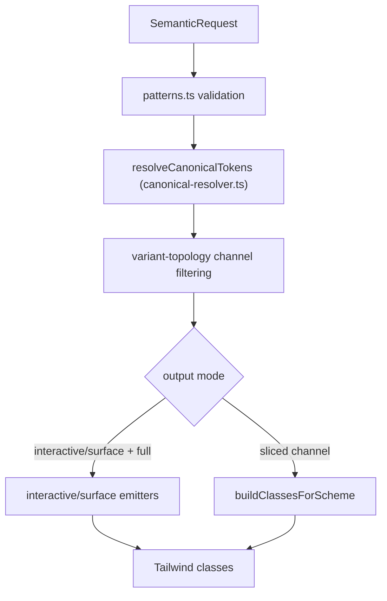
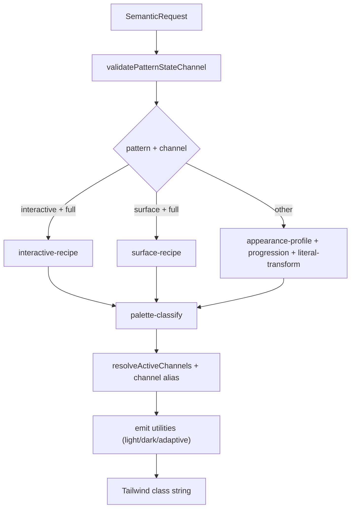

# Centralized Shade System Reference

This document describes the current centralized shade system in detail: architecture, API contracts, semantic dimensions, data-driven internals, and component adoption status across the design system.

---

## 1) System Purpose

The shade system is the semantic styling engine used to convert a normalized semantic request (`pattern`, `variant`, `appearance`, `state`, `channel`, `palette`) into Tailwind utility classes.

Its goals are:

- keep visual decisions data-driven (tables/maps instead of per-component hardcoding)
- provide shared behavior for light/dark/adaptive output
- provide composable API layers for component migration (compose-family + shims)
- centralize variant/state/channel semantics for consistency across components

---

## 2) Architecture Layers

The centralized system currently has three layers.

### Key design note

- `resolveCanonicalTokens()` is the single token authority.
- Composed token tables in `interactive-recipe.ts` drive interactive pattern requests and full-stack surface/interactive output.
- Channel-isolated profile tables (`appearance-profile.ts`, `state-progression.ts`, `literal-transform.ts`) drive sliced surface/field/mark/chrome requests.
- `composer.ts` orchestrates validation, token resolution, topology filtering, and emission.
- API layer defines how components ask for classes.
- Public facade (`shade`) exposes the legacy-compatible namespace.

---

## 3) Core Semantic Contract

All composition paths ultimately rely on `SemanticRequest` from `src/utilities/shade/core/dimensions.ts`.

### 3.1 Dimensions

| Dimension | Values | Notes |
|---|---|---|
| `pattern` | `interactive`, `surface`, `field`, `mark`, `chrome` | determines allowed state/channel combinations |
| `variant` | canonical: `solid`, `outline`, `solidOutline`, `ghost`, `underline`, `solidUnderline` | aliases normalized by `normalizeVariant()` |
| `appearance` | `strong`, `soft`, `dualTone`, `onColor` | aliases normalized by `normalizeAppearance()` (`classic` -> `strong`, `subtle` -> `soft`) |
| `state` | `default`, `hover`, `pressed`, `selected`, `disabled`, `focus`, `error`, `loading`, `indeterminate` | pattern-restricted by validation |
| `channel` | `fill`, `text`, `border`, `outline`, `ring`, `indicator`, `container`, `track`, `thumb`, `arrow`, `full` | filtered by variant topology |
| `palette` | string | normalized (`warm-neutral` -> `warm`, `cool-neutral` -> `cool`) |
| `emit` | `{ adaptive?: boolean, scheme?: "light" \| "dark" }` | adaptive controls dual light/dark emission |

### 3.2 Pattern validation contract

`src/utilities/shade/core/patterns.ts` enforces the state/channel matrix per pattern.

- invalid combinations throw early in `composeSemantic()`
- this is the primary guardrail for semantic correctness

---

## 4) Data-Driven Engine Components

The core is table-driven and split by responsibility.

### 4.1 `dimensions.ts`

- canonical types + alias maps
- normalization helpers:
  - `normalizePalette()`
  - `normalizeVariant()`
  - `normalizeAppearance()`
  - `toLegacyVariant()`

### 4.2 `patterns.ts`

- `PATTERN_RULES`:
  - allowed states per pattern
  - allowed channels per pattern
- `validatePatternStateChannel()` called by `composeSemantic()`

### 4.3 `variant-topology.ts`

- `VARIANT_TOPOLOGY` maps which channels each variant emits
- `CHANNEL_ALIAS` maps semantic channels to core keys:
  - `indicator`/`track`/`thumb` -> `fill`
  - `container` -> `border`
  - `arrow` -> `text`
- `resolveActiveChannels()` is the channel gate

### 4.4 `palette-classify.ts`

- classifies palette into `chromatic`, `neutral`, `literal`
- controls which token resolver branch runs

### 4.5 `canonical-resolver.ts`

- `resolveCanonicalTokens()` — single entry point for channel token maps
- routes composed interactive token tables vs channel-isolated profile tables based on pattern + channel
- consumed exclusively by `composer.ts` (not by components)

### 4.6 `appearance-profile.ts`

- channel-isolated base shade anchors per `appearance` x `scheme`
- internal data table consumed by `canonical-resolver.ts`

### 4.7 `state-progression.ts`

- channel-isolated progression deltas by `pattern` x `state` x `scheme`
- internal data table consumed by `canonical-resolver.ts`

### 4.7 `literal-transform.ts`

- static tables for literal palettes (`white`, `black`, `transparent`)
- state transforms for literal-safe output

### 4.8 Recipe engines

- `interactive-recipe.ts`
  - explicit variant/appearance/scheme step tables for interactive full-stack output
  - state mapping into 3-step model (default/hover/pressed)
- `surface-recipe.ts`
  - surface-specific full output builder
  - delegates token generation behavior to interactive resolver in some paths

### 4.9 `composer.ts` (orchestrator)

`composeSemantic()`:

1. merges defaults (`channel`, `emit`)
2. validates pattern/state/channel
3. dispatches by pattern/channel:
   - `interactive + full` -> interactive recipe path
   - `surface + full` -> surface recipe path
   - else -> generic profile/progression/literal path
4. filters channels via topology
5. emits final utility classes

---

## 5) Dual Composition Paths (Important)

The current centralized system has **two core composition modes**:

1. **Recipe path** (`interactive`/`surface` with `channel: "full"`)
2. **Generic compositional path** (everything else)

This is intentional but can feel split unless consumers stay on one public API family.

### Practical implication

- component consumers should use the compose-family APIs (`compose`, `composeControl*`, `composeSelection*`)
- core recipe internals should remain internal to core

---

## 6) API Contracts

## 6.1 API facade (`src/utilities/shade/api/index.ts`)

### `compose(req)`

- exact one-state semantic composition
- delegates to `composeSemantic(req)`

### `slice(req)`

- alias of `compose(req)`

### `channel(reqWithChannel)`

- alias of `compose(req)` with explicit typed channel requirement

### `stack(reqWithoutState)`

- emits:
  - default state
  - hover-prefixed state
  - pressed-prefixed state (as `active:`)

### `prefixInteractiveClasses(classes, prefix, darkPrefix?)`

- prefixes utility tokens for state stacks
- interactive-specific dark token handling

## 6.2 Control compose (`src/utilities/shade/api/control-compose.ts`)

All helpers are positional and component-facing:

- `composeControlSelected(palette, variant, appearance, adaptive?)`
- `composeControlUnselected(palette, variant, appearance, adaptive?)`
- `composeControlIcon(palette, variant, appearance, adaptive?)`
- `composeControlDot(palette, variant, appearance, adaptive?)`
- `composeControlCard(palette, variant, appearance, adaptive?)`
- `composeControlCardHover(palette, variant, appearance, adaptive?)`

Typical usage:

- selected/on states -> `composeControlSelected`
- unselected/off states -> `composeControlUnselected`
- static surface container -> `composeControlCard`
- hover overlay for surface container -> `composeControlCardHover`

## 6.3 Selection compose (`src/utilities/shade/api/selection-compose.ts`)

- `composeSelectionRow(palette, variant, appearance, state, adaptive?)`
- `composeSelectionLabel(...)`
- `composeSelectionHighlight(...)`
- `composeSelectionInteractive(...)`
- `pickTextUtilities(classes)`
- `pickFillUtilities(classes)`

Typical usage:

- row base state + hover stack in list-like UIs
- text/fill channel extraction for fine-grained composition

## 6.4 Shim family (`src/utilities/shade/api/shims.ts`)

The shim namespace supports legacy/config-object style:

- `interactive`
- `surface`
- `field`
- `control`
- `selection`
- `status`
- `scroll`
- `swatch`
- `neutral`
- `overlay`
- `decorator`
- `shared.postProcess` helpers

`shade` facade in `src/utilities/shade/index.ts` merges `semanticApi` + `shadeShims`.

---

## 7) API Family Positioning and Boundary

### Recommended usage boundary

- **Component-facing:** compose-family
  - `compose()`
  - `composeControl*`
  - `composeSelection*`
- **Legacy compatibility:** shims remain available but should not grow
- **Core internals:** recipe/profile/progression/topology modules are not component-facing

This boundary prevents design language drift.

---

## 8) Component Coverage (Current State)

Below is the current coverage map by component and migration completeness.

### 8.1 Integrated (high confidence)

| Component | Pattern(s) in use | API family | Key file(s) | Status |
|---|---|---|---|---|
| Alert | surface | compose | `src/components/Alert/styles/variants.ts` | complete |
| Toast | surface | compose | `src/components/Toast/styles/variants.ts` | complete |
| Tooltip | surface | compose | `src/components/Tooltip/styles/variants.ts` | complete |
| Popover | surface | compose | `src/components/Popover/styles/variants.ts` | mostly complete |
| Button | interactive | compose + prefix | `src/components/Button/styles/variants.ts` | complete |
| Tag | interactive | compose + prefix | `src/components/Tag/styles/variants.ts` | complete |
| Link | interactive | compose + prefix | `src/components/Link/styles/shadeVariants.ts` | complete |
| Anchor | interactive | compose + prefix | `src/components/Anchor/styles/shadeVariants.ts` | mostly complete |
| BreadCrumbs | interactive | compose + prefix | `src/components/BreadCrumbs/styles/colorVariants.ts` | migrated |
| Tabs | interactive | compose | `src/components/Tabs/styles/variants.ts` | complete |
| Menu | selection-style interactive rows | selection-compose | `src/components/Menu/styles/variants.ts` | migrated |
| Checkbox | control + card | control-compose | `src/components/Checkbox/styles/colorVariants.ts` | mostly complete |
| Radio | control + card | control-compose | `src/components/Radio/styles/item.ts` | mostly complete |
| SegmentedControl | surface container + selection items | control-compose + compose/selection | `src/components/SegmentedControl/styles/*` | migrated |
| ButtonGroup | surface container + selection items | control-compose + compose/selection | `src/components/ButtonGroup/styles/*` | migrated |
| Avatar | selection + surface/control parts | selection-compose + control-compose | `src/components/Avatar/styles/colorVariants.ts` | complete |
| Emptystate | text channel composition | compose + selection utils | `src/components/Emptystate/styles/colorVariants.ts` | mostly complete |
| Stepper | interactive + surface + selection extracts | compose + selection utils | `src/components/Stepper/styles/shadeVariants.ts` | mostly complete |

### 8.2 Integrated but partial / mixed

| Component | What is shaded | What remains manual |
|---|---|---|
| Accordion | base variant matrix in `styles/variants.ts` | additional style-level branches in other style files |
| Badge | primary label/chrome variants | status indicator/dot/ribbon style branches remain manual |
| Input | outer shell border/fill/focus ring via `shade.field.*` | label/addon/other style tokens still partly manual |
| Select | inherits Input shell shading | other select-specific branches remain mixed |
| Label | surface text channel for palette text | proprietary gray text (`gray-10/30/60`) stays manual |
| Listbox | panel/item shade usage present | hex/object fallback paths + manual maps remain |
| NavBar | active item uses selection compose | shell translucency and some text/border classes manual |
| Pagination | partial selection/surface paths | several button states still manual |
| Progress | shade-based map exists | parallel legacy style path still present |
| Slider | control-compose mapping present | legacy code and manual branches still coexist |
| Switch | control-compose for track mapping | DS gray inactive/thumb/shadow paths manual |
| ScrollArea | track/thumb moved to control-compose + surface card | onColor opacity/arrow color paths manual |
| ColorSwatch | control card fill/border | white/black/ring bespoke branches manual |

---

## 9) Non-Integrated or Low-Integration Components

Several components still use manual utility maps/tokens and have not fully adopted shade semantics (or only inherit shade indirectly).

Representative examples include:

- Calendar
- Time
- Modal
- ReactionPicker
- Rating
- ColorPicker
- InputFileUpload
- Transfer
- Cascader
- AppLauncher
- ScrollBar (while ScrollArea is partially migrated)

This list should be treated as migration backlog candidates.

---

## 10) Common Migration Patterns

### 10.1 Surface chrome filtering

Pattern:

- compose full surface/card classes
- filter to bg + border tokens (`pickSurfaceChrome` / `pickChrome`)
- prevent accidental text token inheritance

Seen in:

- SegmentedControl container
- ButtonGroup container
- ScrollArea track
- ColorSwatch card

### 10.2 Selection row stacks

Pattern:

- base: `composeSelectionRow(..., "default")`
- hover/active: prefixed interactive slices via `prefixInteractiveClasses`

Seen in:

- Menu
- Listbox items
- NavBar active rows
- ButtonGroup/Segmented item interactions

### 10.3 Control split

Pattern:

- state fill/border via `composeControlSelected/Unselected`
- card chrome via `composeControlCard`
- hover overlay via `composeControlCardHover`
- ring/indicator extras kept local when proprietary

Seen in:

- Checkbox/Radio
- Switch
- Slider
- ScrollArea thumb
- ColorSwatch

### 10.4 Field shell wiring

Pattern:

- border: `shade.field.border`
- fill: `shade.field.fill`
- focus ring: `shade.field.focusRing`
- retain CVA for radius/padding/layout

Seen in:

- Input outer shell

---

## 11) Data Flow (Runtime)

---

## 12) Known Contract Risks / Inconsistencies

These are important for governance and future cleanup:

- dual composition semantics (recipe path vs generic path) can diverge for equivalent-looking requests
- shim family and compose-family overlap can confuse ownership if both are used freely in components
- some shim methods are legacy convenience wrappers and not feature-parity complete with compose helpers
- partial migrations leave mixed systems in individual components (shade + legacy hardcoded tokens)
- several components use manual hover/active prefixing patterns instead of centralized stack usage

---

## 13) Governance Recommendations

To keep the centralized system cohesive:

1. treat `api/index.ts` + compose helper modules as the primary component API
2. keep shims for backward compatibility only; avoid expanding shim surface
3. keep recipe/profile/progression/topology internal to core
4. enforce import conventions:
   - components import from `src/utilities/shade/api/*` (or `shade.field` where intentionally chosen)
   - components should not import directly from `src/utilities/shade/core/*`
5. add migration parity tests where mixed systems still exist
6. document any manual exceptions explicitly (DS proprietary gray tokens, white/black special cases)

---

## 14) Quick File Index

Core:

- `src/utilities/shade/core/dimensions.ts`
- `src/utilities/shade/core/patterns.ts`
- `src/utilities/shade/core/variant-topology.ts`
- `src/utilities/shade/core/palette-classify.ts`
- `src/utilities/shade/core/appearance-profile.ts`
- `src/utilities/shade/core/state-progression.ts`
- `src/utilities/shade/core/literal-transform.ts`
- `src/utilities/shade/core/interactive-recipe.ts`
- `src/utilities/shade/core/surface-recipe.ts`
- `src/utilities/shade/core/composer.ts`

API:

- `src/utilities/shade/api/index.ts`
- `src/utilities/shade/api/control-compose.ts`
- `src/utilities/shade/api/selection-compose.ts`
- `src/utilities/shade/api/shims.ts`
- `src/utilities/shade/index.ts`

Docs:

- `src/utilities/shade/README.md`
- `src/utilities/shade/docs/vocabulary.md`
- `src/utilities/shade/docs/centralized-shade-system-reference.md`

